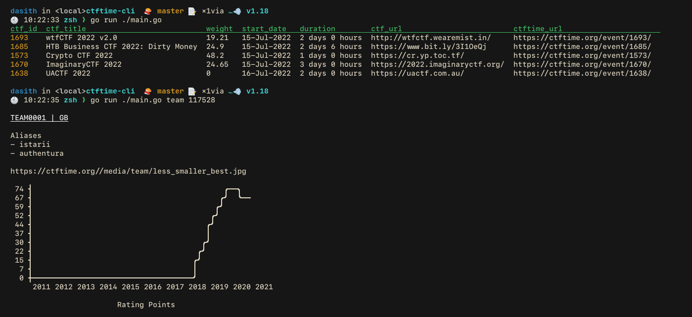

# ctftime-cli

A CLI application which can be used to view up-comming, on-going ctf events, Team Details using ctf-time API and rss feed.

 

## Installation

```bash
go get github.com/z9fr/ctftime-cli
```


